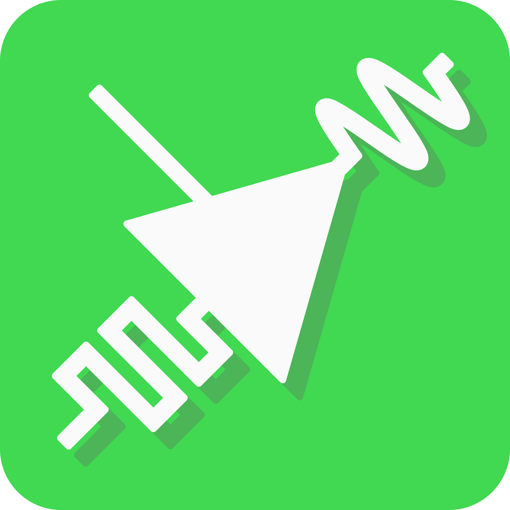
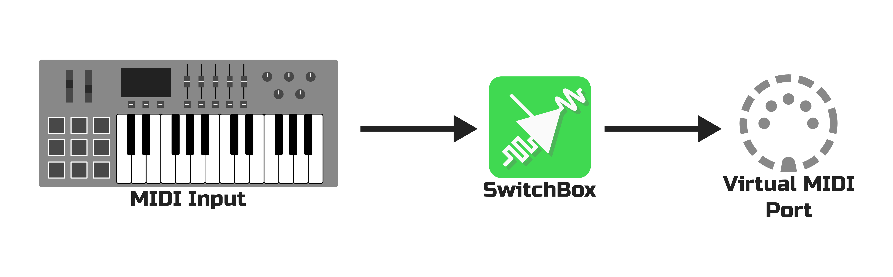

# SwitchBox

SwitchBox is a software-based MIDI translator that can change the channel of incoming MIDI messages in real time. Quickly change instrument voices on a sampler or software synth with the touch of a button. Re-route as many instruments as you like. SwitchBox is designed to be easy to set up and simple to use, so you can get back to making music. 

# How it Works

SwitchBox provides a virtual MIDI port to interface with your audio software. These virtual MIDI ports act exactly like real MIDI ports, and most programs won’t be able to tell the difference.

SwitchBox lets you change the channel of incoming MIDI messages.
Keystrokes and other controls are re-routed to the currently-active channel.

To learn more, visit [SwitchBox's project page](https://someinterestingusername.github.io/SwitchBox/).

# Developing for SwitchBox

You're here because you want to see how SwitchBox works, or you're interested in developing for SwitchBox. That's fantastic! Here's what you'll need to do:

1. Clone or download this repository.

   `git clone https://github.com/SomeInterestingUserName/SwitchBox`

2. Go into the folder that was just created.
3. Install programs necessary to run SwitchBox (Consult your distribution's documentation for instructions):
  * **Python 3.x** (`python3`) (Any version of Python 3, although tested on Python 3.7+)
  * **Tkinter for Python** (`python3-tkinter`) Usually bundled with Python, but install manually if you're getting errors. 
  * **Pip** (`python3-pip`) Optional, but makes the next step easier.
4. Install libraries that SwitchBox uses:
  * **RTMidi** (`rtmidi`) installed with pip: `pip3 install rtmidi`
  * **LXML** (`lxml`) installed with pip: `pip3 install lxml`
5. The main program is located at `src/SwitchBox.py`. Run it in the command line:

   `python3 ./SwitchBox.py`

6. That's it! You're now an official SwitchBox developer!

# Repository Layout
* `src` contains the actual source code for SwitchBox, plus images and other resources.
    * `assets` is where the images and resources are stored. There's also a user manual in here.
* `docs` contains this `README` file, plus the pictures and resources for SwitchBox's GitHub Pages site.
* `deploy` is a place to build SwitchBox into an executable file. It contains Python scripts that can be used with `py2app` to build these executables.
