SwitchBox is a software-based MIDI translator that can change the channel of incoming MIDI messages in real time. Quickly change instrument voices on a sampler or software synth with the touch of a button. Re-route as many instruments as you like. SwitchBox is designed to be easy to set up and simple to use, so you can get back to making music. 

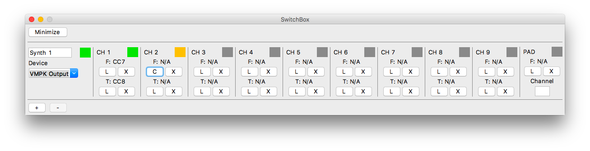

# How it Works

SwitchBox provides a virtual MIDI port to interface with your audio software. These virtual MIDI ports act exactly like real MIDI ports, and most programs won’t be able to tell the difference.

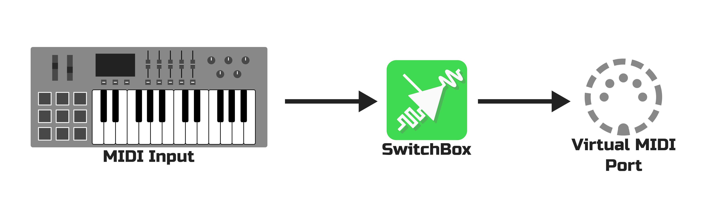

SwitchBox lets you change the channel of incoming MIDI messages.
Keystrokes and other controls are re-routed to the currently-active channel.

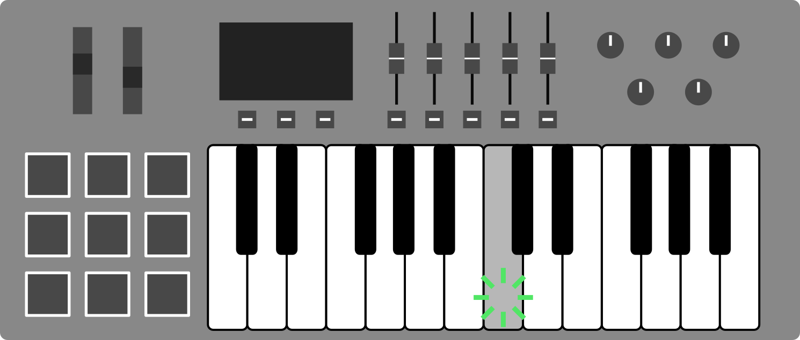
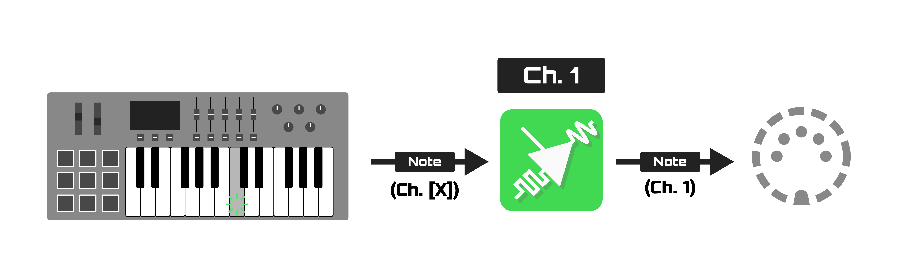

### Activate a Channel

Change channels with a push of a button, a turn of a knob, or whatever other control you want. SwitchBox will start redirecting MIDI messages to that channel. 

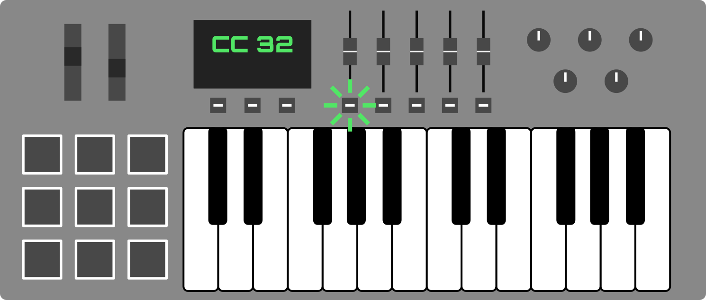
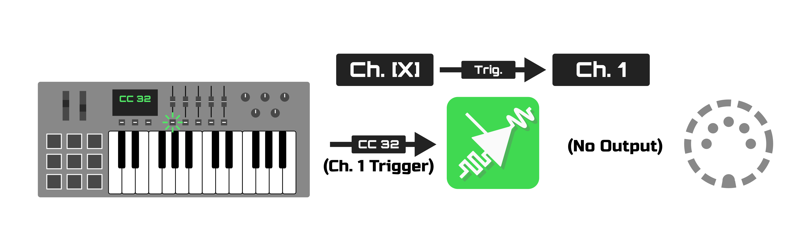

### Pair Controls to a Channel

SwitchBox lets you assign special Fader controls that always get rerouted to certain channels.


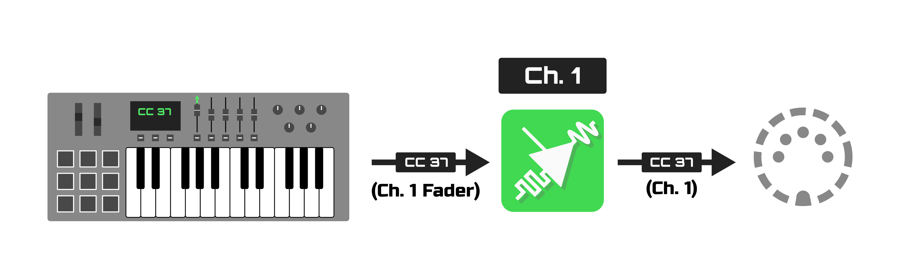

This can be used for making sure volume controls stay updated, even if you move them after switching to another channel.

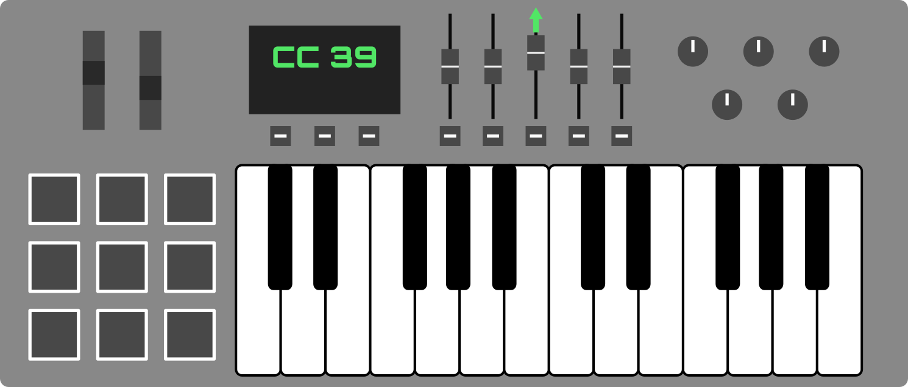
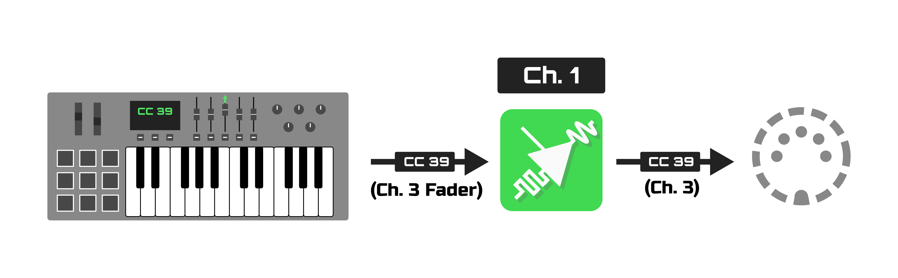

# Features

### PAD (Pad Auto Detect) Channel

The PAD channel is intended for instruments with percussion or sample pads. When configured, it automatically activates when a pad is pressed.

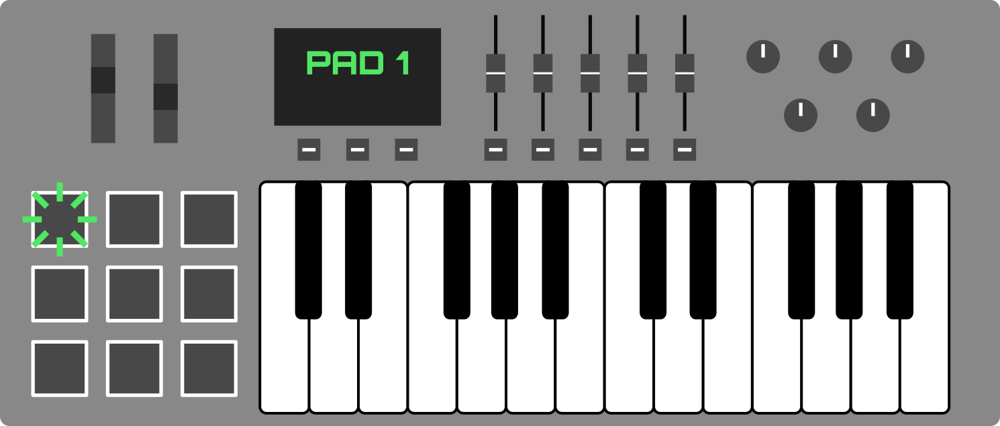
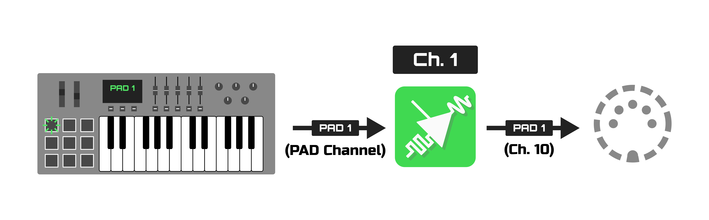

### Indicator Lights
Quickly check status, at a glance.

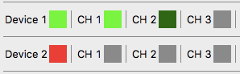

### Helpful Hints
SwitchBox lets you know what’s wrong, in plain English. No need to memorize colors or error codes--SwitchBox has your back.

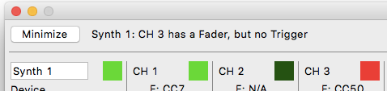

### Expandable
Whether you’re going solo or rehearsing with the band, SwitchBox has room for everyone, and plenty of virtual MIDI ports to spare.

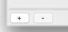

### Compact
Minimize SwitchBox to save screen real estate, while still keeping all the important stuff visible.

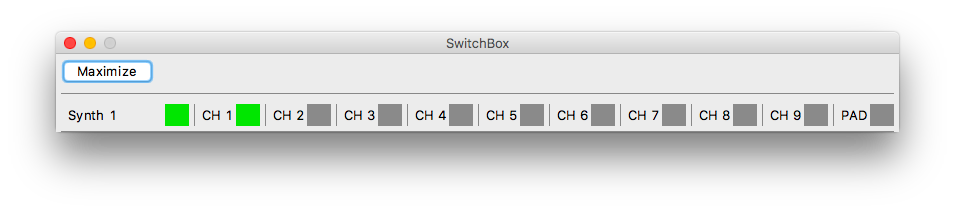

### Auto-Save
SwitchBox will automatically save any settings you change, the moment you change them. Even if something goes wrong, SwitchBox is ready to pick up where you left off.

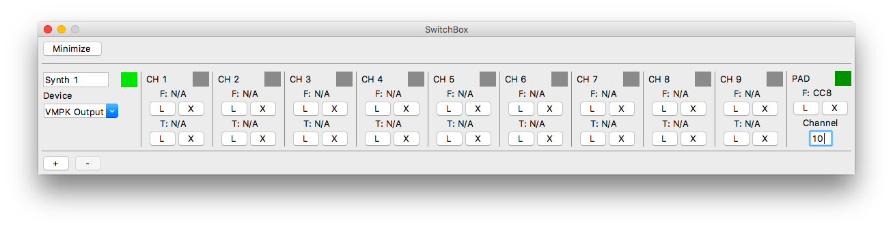

# Getting Started

### macOS Users

1. Click **macOS Download (.zip)** at the top of this page. 
2. Open the .zip file you just downloaded. It'll expand into a folder.
3. Inside the folder are two things:
  * The SwitchBox app
  * A User's Manual
4. Drag the app into your Applications folder, or wherever you normally keep apps.
5. Double-click to open, and you're ready to start making music!
  * **Note:** If you get an "Unidentified Developer" warning, simply right-click the app and select "Open" from there. This is a one-time process, and SwitchBox can be opened normally in the future. Becoming an "identified developer" is expensive. 

### Linux Users

1. Click **Source Download (.tar.gz)** at the top of this page.
2. Extract the compressed archive.
3. Install system dependencies (Consult your distribution's documentation for instructions):
  * **Python 3.x** (`python3`) (Any version of Python 3, although tested on Python 3.7+)
  * **Tkinter for Python** (`python3-tkinter`) Usually bundled with Python, but install manually if you're getting errors. 
  * **Pip** (`python3-pip`) Optional, but makes the next step easier.
4. Install Python dependencies:
  * **RTMidi** (`rtmidi`) installed with pip: `pip3 install rtmidi`
  * **LXML** (`lxml`) installed with pip: `pip3 install lxml`
5. The main program is located at `src/SwitchBox.py`. Run it in the command line:

   `python3 ./SwitchBox.py`

6. You can write a simple script to automatically execute the above:

   ```bash
   #!/bin/bash

   # This is where the SwitchBox folder is located on your computer. 
   SWITCHBOX_FOLDER_PATH=''

   python3 $SWITCHBOX_FOLDER_PATH/src/SwitchBox.py
   ```
   Then, run `chmod +x [NAME_OF_SCRIPT]` to mark it as executable. Now, you can just double-click your script to launch SwitchBox. 

# Frequently Asked Questions

### How many instruments can SwitchBox handle at a time?
  There isn't a hard limit, but it depends on your computer's performance.

### Is SwitchBox available for Windows?
  Not at the moment, but it might someday. Windows doesn't do virtual MIDI ports the same way macOS or Linux does, so things got complicated. 

### Is SwitchBox really free?
  You bet! SwitchBox is a volunteer project, and will always be available free of charge to anyone. There's no ads, data-mining, or activation codes. Just music-making. Do note that SwitchBox does not come with a warranty. 

### Can I use SwitchBox for my performance?
  Absolutely! Even if it's for-profit. Although not required, crediting SwitchBox would be greatly appreciated if you found it helpful for you.

### What's with the Australian version names?
  It's a long story about SwitchBox's original name, and the barrage of kangaroo puns that ensued. 

### I lost the manual. How can I get help?
  Simply open SwitchBox and press **F1**. A shiny new manual will appear before your eyes!

# Version History

### 1.0 "Canberra"
* 1.0 (05 Aug. 2019)
  * Tidy up code and add comments to literally everything
  * Fix a weird savefile loading bug involving the PAD channel
  * Tweak indicator light logic
  * Add a user manual
  * Add error messages
  * Move code to GitHub

### 0.2 "Brisbane"
* 0.21b (22 Apr. 2019)
  * Tweak "About" menu focusing logic

* 0.2b (20 Apr. 2019)
  * Adjust save files
  * Re-work default naming logic
  * Fix issues with maximizing/minimizing
  * Add an "About" menu

### 0.1 "Adelaide"
* 0.11b (31 Dec. 2017)
  * Un-stick sticking keys when channel switch is triggered
* 0.1b (26 Jun. 2017)
  * Initial Release
